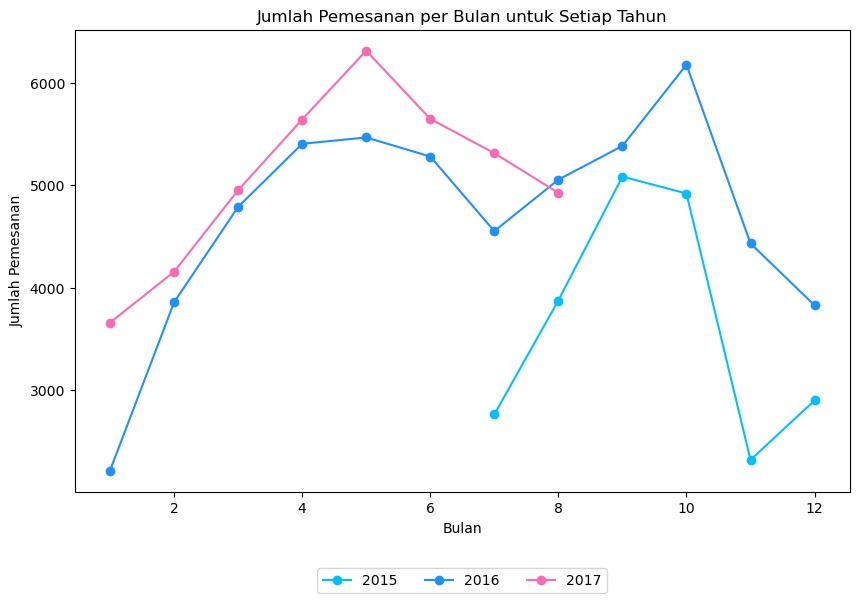
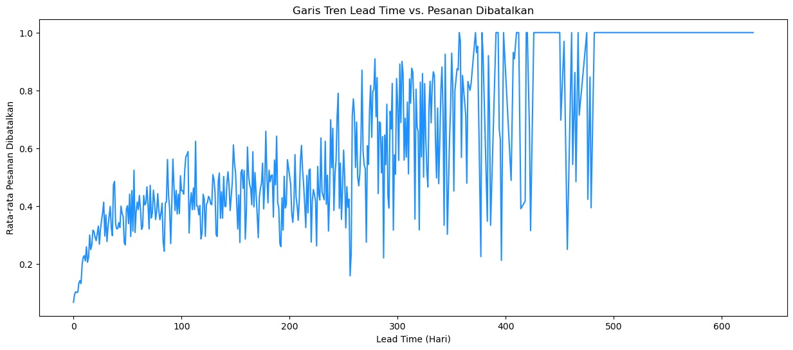
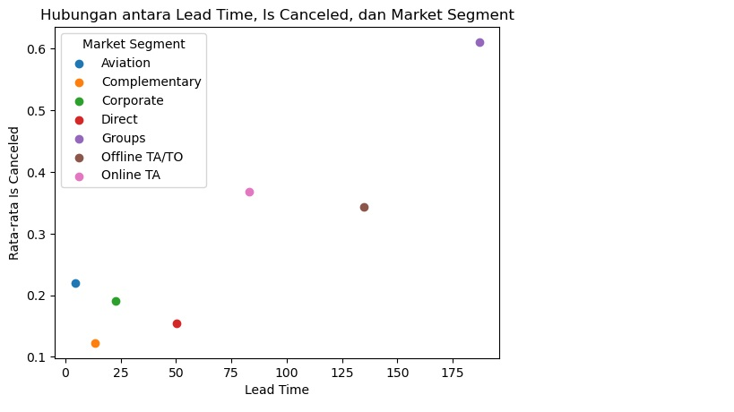
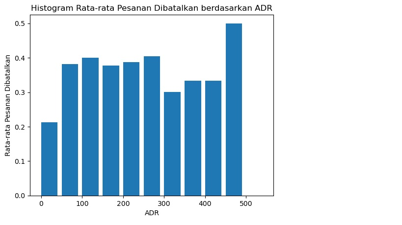
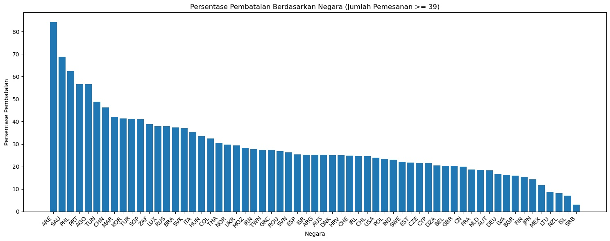

# 
 Analisis Data Pemesanan Hotel 

## Table of Contents

  * [Pendahuluan](#pendahuluan)
  * [Package yang Diperlukan](#package-yang-diperlukan)
  * [Data Preparation](#data-preparation)
  * [Eksplorasi dan Analisis Data](#eksplorasi-dan-analisis-data)
  * [Rangkuman](#rangkuman)

## Pendahuluan

**1. Pernyataan Masalah:**

Industri perhotelan sangat dinamis dan kompetitif. Kemampuan untuk memprediksi dan mencegah pembatalan pemesanan menjadi krusial bagi hotel untuk mengoptimalkan pendapatan dan efisiensi operasional. Pembatalan pemesanan dapat menyebabkan kerugian finansial, mengurangi utilisasi kamar, dan meningkatkan biaya operasional.

Konsumen, dalam hal ini pihak manajemen hotel, seharusnya tertarik dengan analisis ini karena:

  * **Meningkatkan pendapatan:** Dengan memahami faktor-faktor penyebab pembatalan, hotel dapat mengambil langkah-langkah pencegahan untuk mengurangi tingkat pembatalan dan meningkatkan pendapatan.
  * **Optimalisasi sumber daya:** Mencegah pembatalan membantu hotel mengoptimalkan alokasi sumber daya seperti staf, inventaris, dan fasilitas.
  * **Meningkatkan kepuasan pelanggan:** Dengan memahami kebutuhan dan preferensi pelanggan, hotel dapat memberikan layanan yang lebih baik dan meningkatkan kepuasan pelanggan, yang pada akhirnya dapat mengurangi pembatalan.

**2. Rencana Penanganan Masalah:**

Untuk mengatasi masalah ini, kita akan menggunakan data historis pemesanan hotel yang meliputi berbagai variabel seperti:

  * **Data Pemesanan:** Tanggal pemesanan, tanggal kedatangan, lama menginap, jenis kamar, jumlah tamu, harga kamar (ADR), dan saluran pemesanan (market segment).
  * **Data Pelanggan:** Negara asal, jenis pelanggan (individu/kelompok).
  * **Data Pembatalan:** Status pembatalan (dibatalkan/tidak dibatalkan), lead time (waktu antara pemesanan dan kedatangan).

Metodologi yang digunakan meliputi:

  * **Analisis Deskriptif:** Untuk memahami karakteristik data dan mengidentifikasi pola awal.
  * **Analisis Eksploratif:** Untuk menggali hubungan antara variabel dan mengidentifikasi faktor-faktor yang berkorelasi dengan pembatalan pemesanan.
  * **Visualisasi Data:** Untuk menyajikan hasil analisis secara informatif dan mudah dipahami.

**3. Pendekatan/Teknik Analisis:**

  * **Analisis Tren:** Menganalisis tren pemesanan dan pembatalan berdasarkan waktu (tahun, bulan) untuk mengidentifikasi pola musiman.
  * **Analisis Korelasi:** Menganalisis hubungan antara variabel-variabel seperti lead time, market segment, ADR, dan negara asal dengan tingkat pembatalan.
  * **Segmentasi Pelanggan:** Mengelompokkan pelanggan berdasarkan karakteristik dan perilaku pemesanan untuk mengidentifikasi segmen yang rentan terhadap pembatalan.

**4. Manfaat Analisis bagi Konsumen:**

Hasil analisis ini akan membantu pihak hotel dalam:

  * **Mengidentifikasi faktor risiko:** Mengetahui faktor-faktor yang paling berpengaruh terhadap pembatalan pemesanan.
  * **Mengembangkan strategi pencegahan:** Merancang strategi yang ditargetkan untuk mengurangi pembatalan, seperti penawaran khusus, kebijakan pembatalan yang fleksibel, dan program loyalitas.
  * **Mengoptimalkan operasional:** Meningkatkan efisiensi operasional dengan memprediksi permintaan dan alokasi sumber daya yang lebih baik.
  * **Meningkatkan pengambilan keputusan:** Memberikan informasi yang akurat dan relevan untuk mendukung pengambilan keputusan strategis.

Dengan memanfaatkan hasil analisis ini, hotel dapat meningkatkan kinerja bisnis, mengurangi kerugian akibat pembatalan, dan memberikan layanan yang lebih baik kepada pelanggan.

## Package yang Diperlukan

Berikut adalah daftar package Python yang digunakan dalam analisis ini. Pastikan Anda telah menginstal package-package ini sebelum menjalankan kode:

  * **python:** 3.10.16
  * **pandas:** 2.2.3 (untuk manipulasi dan analisis data)
  * **tabulate:** 0.9.0 (untuk menampilkan data dalam bentuk tabel)
  * **scikit-learn:** 1.6.0 (untuk melakukan encoding, dan machine learning jika diperlukan)
  * **matplotlib:** 3.10.0 (untuk visualisasi data)

## Data Preparation

**1. Sumber Data:**

Data yang digunakan dalam analisis ini berasal dari dataset terbuka tentang permintaan pemesanan hotel yang dibuat oleh Antonio, Almeida, dan Nunes (2019). Dataset ini dapat diakses melalui tautan berikut:

  * [https://www.dropbox.com/sh/qwdaldzkp8yrqwj/AADTj_WQcuKA0bsEeCKU__98a?dl=1](https://www.dropbox.com/sh/qwdaldzkp8yrqwj/AADTj_WQcuKA0bsEeCKU__98a?dl=1)

**2. Deskripsi Data:**

  * **Tujuan Awal:** Dataset ini ditujukan untuk berbagai keperluan analisis dan riset di bidang perhotelan, seperti prediksi pembatalan pemesanan, segmentasi pelanggan, analisis kepuasan pelanggan, dan studi tentang tren musiman.
  * **Waktu Pengumpulan:** Dataset ini mencakup data pemesanan hotel dari tahun 2015 hingga 2017.
  * **Variabel:** Dataset asli memiliki banyak variabel yang berkaitan dengan pemesanan hotel, termasuk informasi tentang pemesanan, pelanggan, dan status pembatalan.
  * **Kekhasan:** Dataset ini memiliki beberapa nilai yang hilang (missing values), terutama pada variabel `country`. Nilai yang hilang tersebut akan ditangani selama proses pembersihan data.

**3. Impor dan Pembersihan Data:**

  * **Impor:** Data diimpor menggunakan library `pandas` dalam Python.
  * **Pembersihan:**
      * **Menghapus baris dengan nilai NaN pada kolom `country`**: Karena negara (`country`) merupakan salah satu variabel penting dalam analisis ini, baris yang tidak memiliki data negara akan dihapus.
      * **Menghapus baris dengan nilai 'Undefined' pada kolom `market_segment`**: Nilai 'Undefined' pada `market_segment` menunjukkan data yang tidak terdefinisi dengan baik, sehingga baris tersebut  dihapus.
      * **Label Encoding pada kolom `market_segment` dan `country`**: Label encoding dilakukan untuk mengubah nilai-nilai kategorikal pada kolom `market_segment` dan `country` menjadi nilai numerikal, yang diperlukan untuk menghitung korelasi dengan kolom `is_canceled`.

**4. Informasi Ringkasan Variabel:**

Variabel-variabel yang digunakan dalam analisis ini dipilih berdasarkan nilai korelasi mereka terhadap variabel target, yaitu `is_canceled`. Hanya variabel-variabel dengan korelasi yang cukup signifikan yang disertakan dalam analisis.

Berikut adalah informasi ringkasan tentang variabel-variabel tersebut:

  * `is_canceled`: Status pemesanan (0 untuk tidak dibatalkan, 1 untuk dibatalkan)
  * `lead_time`: Waktu antara pemesanan dan kedatangan (dalam hari)
  * `arrival_date_year`: Tahun kedatangan
  * `arrival_date_month`: Bulan kedatangan
  * `country`: Negara asal tamu
  * `market_segment`: Segmen pasar pemesanan
  * `adr`: Average Daily Rate (harga rata-rata per malam)

Informasi tambahan:

  * **Tipe data**: Sebagian besar variabel bertipe data numerik (integer atau float), dengan beberapa variabel kategorikal seperti `hotel`, `arrival_date_month`, `country`, `market_segment`, dan lainnya.
  * **Rentang nilai**: Setiap variabel memiliki rentang nilai yang berbeda. Misalnya, `lead_time` berkisar dari 0 hingga 737 hari, `adr` berkisar dari 0 hingga 5400.

## Eksplorasi dan Analisis Data

Berikut adalah beberapa informasi baru yang ditemukan dalam data, disajikan dalam bentuk plot dan tabel:

**1. Tren Pemesanan per Bulan untuk Setiap Tahun**

**2. Garis Tren Lead Time vs. Pesanan Dibatalkan**

**3. Garis Tren Market Segment vs. Pesanan Dibatalkan**

**4. Hubungan antara Lead Time, Is Canceled, dan Market Segment**

**5. Histogram Rata-rata Pesanan Dibatalkan berdasarkan ADR**

**6. Persentase Pembatalan Berdasarkan Negara (Jumlah Pemesanan >= 39)**

**Top 10 Negara dengan Persentase Pembatalan Tertinggi**

|Negara|Persentase Pembatalan|
|:---|:---|
|ARE|84.31|
|SAU|68.75|
|PHL|62.50|
|PRT|56.64|
|AGO|56.63|
|TUN|48.72|
|CHN|46.25|
|MAR|42.08|
|KOR|41.35|
|TUR|41.13|

**Wawasan:**

  * Terdapat tren peningkatan jumlah pemesanan dari tahun 2015 hingga 2017.
  * Terdapat fluktuasi musiman dalam jumlah pemesanan, dengan puncak pemesanan terjadi di bulan Agustus.
  * Semakin lama `lead_time`, semakin tinggi kemungkinan pemesanan dibatalkan.
  * Beberapa `market_segment`, seperti Groups, memiliki rata-rata pembatalan yang lebih tinggi daripada yang lain.
  * `Market segment` Groups juga memiliki tingkat `lead_time` paling tinggi daripada yang lain, yang memvalidasi dimana semakin lama `lead_time`, maka semakin tinggi pula tingkat kemungkinan pemesanan dibatalkan.
  * Terdapat hubungan antara ADR dan tingkat pembatalan. Semakin tinggi ADR, semakin besar pula kemungkinan Tingkat pembatalan.
  * United Arab Emirates (ARE) memiliki persentase pembatalan tertinggi, sedangkan Serbia (SRB) memiliki persentase pembatalan terendah.

**Kesimpulan:**

Analisis ini berhasil mengidentifikasi beberapa faktor yang berkorelasi dengan pembatalan pemesanan hotel. Informasi ini dapat digunakan untuk mengembangkan strategi untuk mengurangi tingkat pembatalan dan meningkatkan pendapatan hotel.

## Rangkuman

**1. Pernyataan Masalah:**

Tujuan analisis ini adalah untuk memahami faktor-faktor yang mempengaruhi pembatalan pemesanan hotel, yang merupakan masalah penting bagi industri perhotelan karena pembatalan dapat menyebabkan kerugian finansial dan inefisiensi operasional.

**2. Penanganan Masalah:**

Kami menggunakan data historis pemesanan hotel dari tahun 2015 hingga 2017 yang mencakup data pemesanan, pelanggan, dan pembatalan. Metodologi yang digunakan meliputi analisis deskriptif, analisis eksploratif, dan visualisasi data.

**3. Wawasan Menarik:**

  * Terdapat tren peningkatan pemesanan dari tahun 2015 hingga 2017 dengan fluktuasi musiman.
  * `lead_time`, `market_segment`, dan ADR berkorelasi dengan tingkat pembatalan.
  * United Arab Emirates memiliki persentase pembatalan tertinggi.

**4. Implikasi bagi Konsumen:**

Hasil analisis ini dapat membantu hotel:

  * Mengidentifikasi faktor risiko pembatalan.
  * Mengembangkan strategi pencegahan.
  * Mengoptimalkan operasional.
  * Meningkatkan pengambilan keputusan.

**5. Keterbatasan dan Perbaikan:**

  * **Keterbatasan data**: Analisis ini terbatas pada data historis yang tersedia, yang mungkin tidak mencakup semua faktor yang relevan.
  * **Model prediktif**: Analisis ini tidak mengembangkan model prediktif untuk memperkirakan probabilitas pembatalan.
  * **Generalisasi**: Hasil analisis mungkin tidak dapat digeneralisasikan ke semua jenis hotel atau pasar.

**Perbaikan dan Pengembangan:**

Analisis dapat ditingkatkan dengan:

  * Mengumpulkan data tambahan, termasuk ulasan pelanggan, data cuaca, dan data kompetitor.
  * Mengembangkan model prediktif menggunakan machine learning.
  * Melakukan analisis segmentasi pelanggan yang lebih mendalam.
  * Memperluas analisis ke berbagai jenis hotel dan pasar.

Dengan mengatasi keterbatasan ini dan mengembangkan analisis lebih lanjut, pihak hotel dapat memperoleh pemahaman yang lebih komprehensif tentang faktor-faktor yang memengaruhi pembatalan pemesanan dan mengambil langkah-langkah yang lebih efektif untuk mengurangi pembatalan dan meningkatkan kinerja bisnis.

**Catatan:**

  * Pastikan untuk mengganti "[Gambar 1]", "[Gambar 2]", dst. dengan gambar yang sesuai.
  * Anda dapat menambahkan atau mengubah bagian sesuai kebutuhan.
